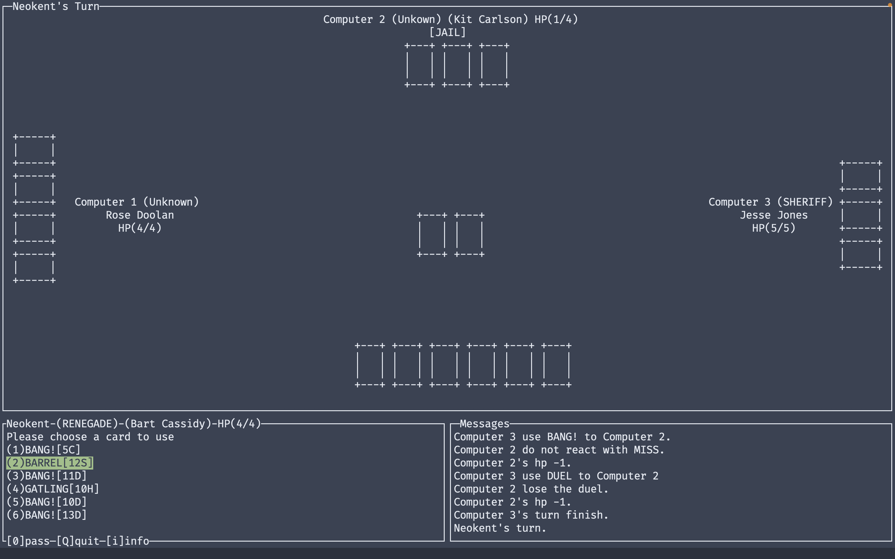

# BANG!



## Dependencies

* Linux
		```
		$ sudo apt-get install libncurses5-dev libncursesw5-dev
		```
* MacOSX
		```
		$ brew install ncurses
		```
* Window
		```
		$ F*ck yourself
		```

## Build
```
$ git clone git@github.com:KennethOng02/Bang.git
$ cd Bang
$ make
```

## Usage
```
$ ./bin/main -p [player_size]
```
or
```
$ make run
```
which defaults to 4 players

## Authors
* Din (https://github.com/din2009siuc)
* Brian (https://github.com/brian098091)
* Kenneth (https://github.com/KennethOng02)
